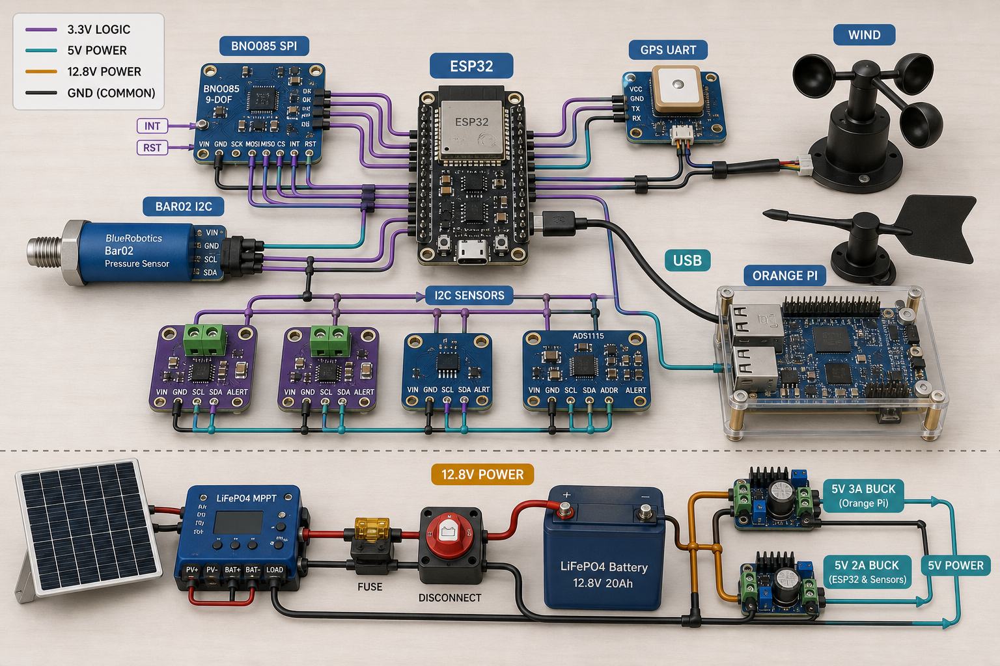
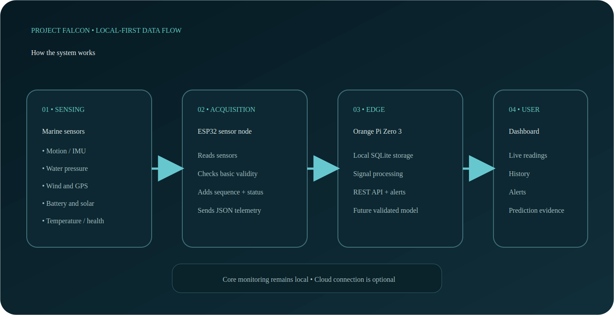
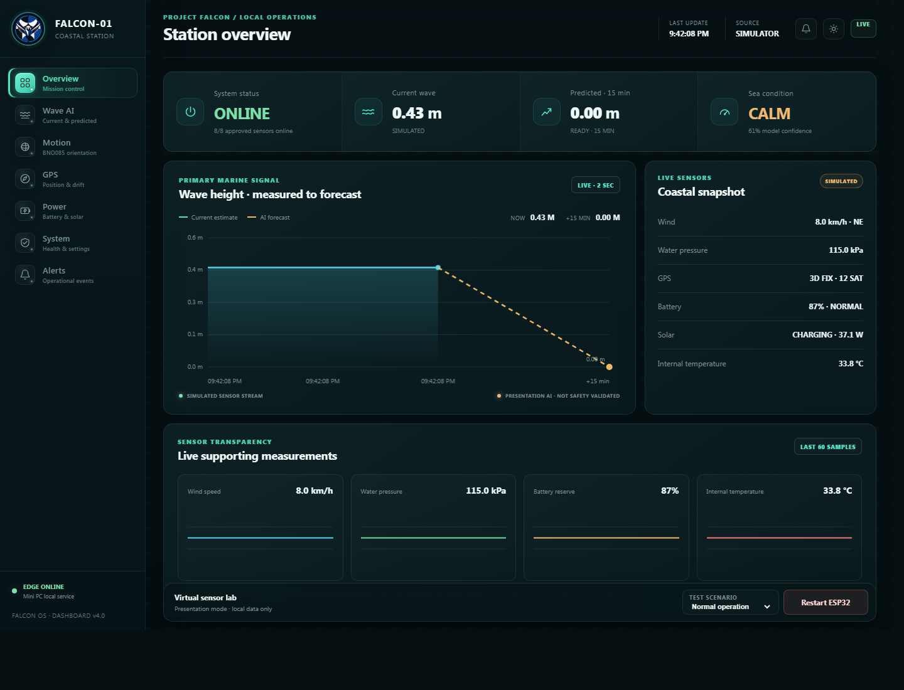
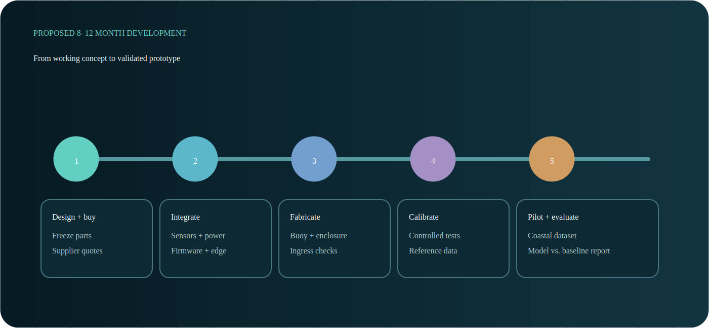
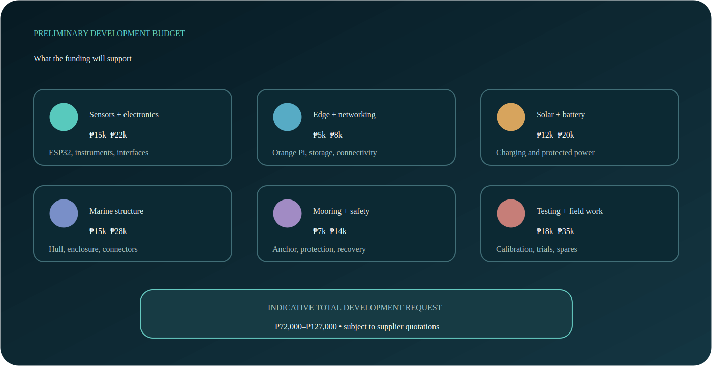

# Project FALCON — DOST Idea Presentation Package

> Presentation baseline updated for v6.1. The physical/visual prototype is under redesign; replace all prototype figures and placement explanations only after approval. Do not present an older CAD model or render as the current unit.

| Field | Value |
| --- | --- |
| Presentation type | Initial idea and funding presentation |
| Project | FALCON-01 — Fullbright College's Local Coastal Observation Network |
| Institution | Fullbright College |
| Current stage | Software and engineering concept prototype |
| Funding purpose | Physical development, integration, calibration, and field validation |
| Prepared | 2026-08-15 |

## 1. Core Presentation Message

Project FALCON is a proposed affordable, solar-powered smart coastal observation
buoy. It is designed to collect localized coastal measurements, process and
store data near the source, display present conditions through a responsive
dashboard, optionally evaluate short-horizon wave prediction after the monitoring baseline is validated,
and detect abnormal buoy displacement or system-health conditions.

The project is not being presented as a finished oceanographic product. The team
has developed the system architecture, dashboard, simulator, firmware foundation,
sensor and wiring plan, mechanical concepts, and technical documentation. Funding
will enable the team to purchase the selected components, fabricate the buoy,
integrate and calibrate the sensors, gather coastal data, train and validate the
prediction model, and conduct a supervised pilot deployment.

### Recommended opening statement

> Good day. We are the Project FALCON Research Group from Fullbright College.
> We are proposing an affordable, solar-powered smart coastal observation buoy
> designed to provide localized wave information through embedded sensing, edge
> computing, and a simple monitoring dashboard. We have completed the system
> concept and software demonstration. We are seeking development support to build,
> calibrate, and validate the physical prototype in a controlled coastal setting.

## 2. Ten-Slide Pitch Deck

### Simple terms to use during the presentation

| Technical term | Listener-friendly explanation |
| --- | --- |
| Buoy | A floating device placed on the water to collect information |
| Sensor | A small electronic instrument that measures one condition |
| ESP32 | The small controller that reads the sensors repeatedly |
| Bay Station | The shore computer that saves, processes, predicts, and displays the data |
| Shore-based processing | Processing performed at the protected Bay Station instead of inside the buoy |
| Telemetry | The measurements sent from the sensors to the computer |
| Simulator | Software-generated test data used before actual hardware is ready |
| AI model | A program trained using past data to estimate a future value |
| Calibration | Comparing a sensor with a trusted reference and correcting its readings |
| Validation | Testing whether the complete system performs accurately and reliably |

Use the simple explanation first. Mention the technical term afterward only when
needed. Do not explain every component unless the panel asks for more detail.

### Slide 1 — Project Title

**What listeners should remember:** FALCON is an affordable smart buoy concept
that will collect and explain localized coastal information.

**PROJECT FALCON**  
Fullbright College's AI-powered Live Coastal Observation Network

**One-line description:** An affordable solar-powered coastal buoy for localized
wave monitoring, edge data processing, short-horizon prediction research, and
buoy health and displacement alerts.

**Visuals:** Project logo, clean buoy render, and one dashboard screenshot.

**Speaker note:** Introduce the team, school, project name, and the single problem
the proposal addresses. Avoid starting with component specifications.

**Taglish presentation script:**

> Magandang araw po. Kami po ang Project FALCON Research Group mula sa
> Fullbright College. FALCON stands for Fullbright College's AI-powered Live
> Coastal Observation Network. Our proposal is an affordable, solar-powered
> smart coastal buoy for localized wave monitoring. It will collect coastal
> data, process it locally, and present the results through an easy-to-use
> dashboard. It will also serve as a research platform for short-term wave
> prediction and system protection. Today, we will explain the problem, our
> proposed solution, our current progress, and the support needed to build and
> validate the physical prototype.

### Slide 2 — The Problem

**What listeners should remember:** Coastal users may receive a general forecast,
but they can still lack an affordable instrument for observing their exact site.

- Coastal decisions benefit from timely and location-specific sea-condition data.
- Professional oceanographic systems can be difficult for small institutions to
  acquire, operate, and maintain.
- Generic forecasts may not represent conditions at a specific near-shore site.
- Connectivity, energy, maintenance, and equipment security complicate continuous
  coastal monitoring.

**Speaker note:** Connect the problem to a specific intended Palawan user or pilot
site once stakeholder confirmation is available. Do not claim that no monitoring
exists; state that affordable localized access is limited for the intended user.

**Taglish presentation script:**

> The main problem is limited access to affordable and location-specific coastal
> information. Official forecasts and professional monitoring systems already
> exist, but specialized equipment can be expensive and difficult for a small
> institution or coastal group to deploy and maintain. Actual near-shore
> conditions at one site may also differ from a wider forecast area. Continuous
> monitoring has other challenges, such as unstable connectivity, limited power,
> maintenance, and possible buoy displacement. For example, a coastal user may
> know the general forecast for Palawan but still need to observe the conditions
> near a specific launch point or research site. So ang target gap namin is not
> the absence of monitoring. It is the need for a more affordable instrument that
> can collect local observations at one clearly identified pilot site.

### Slide 3 — Proposed Solution

**What listeners should remember:** FALCON measures the water environment, saves
the information locally, and shows it on a simple dashboard.

Project FALCON combines:

- wave-related sensors and system-health monitors;
- an ESP32 for reliable sensor acquisition and diagnostics;
- an LTE/cellular telemetry link and shore Bay Station for storage, processing, API, and AI prediction;
- solar power with battery storage;
- a responsive local dashboard;
- offline buffering for intermittent connectivity; and
- persistent GPS geofence, vibration/tamper, and enclosure-access alerts.

**Speaker note:** Explain the system in plain language: measure, validate, store,
analyze, display, and alert.



*Visual guide only. Final physical connections must follow the approved pinout,
purchased-board datasheets, and electrical protection plan.*

**Taglish presentation script:**

> Our proposed solution is Project FALCON. The buoy uses sensors for motion,
> water pressure, wind, GPS position, power, and system health. The ESP32 handles
> regular sensor acquisition and initial validation. It then sends the data to
> the selected cellular link. A protected shore Bay Station stores and processes
> the records, serves the dashboard, and runs the required prediction model. Users can view the information through a
> responsive dashboard on a laptop, tablet, or phone. Solar-powered din ang
> design, and local buffering protects the data during Internet interruptions.
> In simple terms, the ESP32 is the buoy sensor controller, while the Bay Station is the
> protected shore computer. We also propose GPS and tamper checks for
> detecting when the buoy moves beyond its expected area.

### Slide 4 — How It Works

**What listeners should remember:** Sensors measure, the ESP32 collects, the
the Bay Station processes, and the dashboard explains.

```text
Wave, motion, wind, GPS, power and health sensors
                         |
                         v
              ESP32 acquisition layer
                         |
                  LTE / CELLULAR
                         v
          Shore-based Bay Station mini PC
             |          |          |
          Storage    Processing    Local API
             \          |          /
                         v
                 FALCON dashboard
```

**Speaker note:** The ESP32 handles deterministic sensing and short-outage buffering. The shore Bay Station handles heavier software. Deployed remote delivery depends on cellular coverage, while sensing and local security continue during outages.



**Taglish presentation script:**

> This diagram shows the system workflow. First, the sensors collect wave,
> motion, wind, GPS, power, and health measurements. The ESP32 reads and checks
> those values, then packages them as telemetry. The data are sent to the Orange
> Bay Station through the selected LTE/cellular link. The Bay Station manages the database, signal
> processing, API, dashboard, and future model inference. Finally, the user can
> view current measurements, historical data, alerts, and model output on the
> FALCON dashboard. Kapag pansamantalang nawala ang cellular link, tuloy ang sensing at local security, at ibabalik ang buffered records after reconnection.

### Slide 5 — Current Progress

**What listeners should remember:** The software concept works, but funding is
still required to build, calibrate, and test the physical buoy.

**Already developed:**

- responsive multi-page dashboard;
- coherent sensor and fault simulator;
- ESP32 firmware foundation and captive portal;
- versioned ESP32-to-edge telemetry contract;
- Python edge service, local database, API, alerts, and forecast presentation;
- wiring diagrams and Wokwi visual baseline;
- parametric mechanical concepts and Revision 5 buoy baseline;
- hardware bill of materials, power calculations, test plan, and documentation.

**Current verification:**

- ESP32 firmware builds successfully;
- 18 edge-service automated tests pass; and
- Dashboard Next production build passes.

**Not yet completed:** physical sensor integration, assembled marine power system,
field-trained AI, calibration, and marine deployment validation.



*Dashboard values shown during the presentation are simulator-generated and are
not yet live coastal measurements.*

**Taglish presentation script:**

> At the current stage, FALCON is already more than a drawing or raw idea. We
> have a working responsive dashboard, a sensor and fault simulator, an ESP32
> firmware foundation, a telemetry protocol, a Python edge service, a local
> database, APIs, alerts, wiring diagrams, mechanical concepts, a bill of
> materials, and testing documents. The firmware and dashboard build successfully,
> and the automated edge tests pass. However, transparent po kami na simulated
> data pa ang demo. The complete physical buoy, calibrated sensors, and
> field-trained AI are not yet finished. Those are the main activities that the
> requested development support will enable. The simulator is similar to a flight
> simulator: it lets us test the software workflow and possible fault conditions,
> but it does not replace actual hardware and field testing.

### Slide 6 — Innovation and Differentiation

**What listeners should remember:** The innovation is the affordable and locally
adapted combination of the system—not the invention of a new sensor or AI method.

- Affordable and modular student-scale architecture.
- Local edge processing instead of mandatory cloud dependence.
- Focused wave-monitoring scope rather than uncontrolled sensor expansion.
- Dashboard transparency: input quality, prediction horizon, model version,
  recent error, and uncertainty are intended to accompany model output.
- Combined monitoring of observations, energy, position, and system health.
- Reproducible documentation for future school and community research.

**Defensible novelty statement:**

> FALCON's innovation is the validated integration and local adaptation of its
> sensing, edge-computing, energy, prediction, and protection subsystems—not the
> invention of an individual sensor, buoy, or machine-learning algorithm.

**Taglish presentation script:**

> FALCON does not claim to invent the buoy, the sensors, or the AI algorithm.
> Our contribution is the validated integration and local adaptation of these
> technologies in one affordable and modular platform. Processing is performed
> locally, so cloud access is not mandatory. The sensor scope is focused to keep
> calibration, cost, and energy requirements manageable. The dashboard is also
> designed to clearly distinguish simulated, measured, estimated, and predicted
> values. In short, ang innovation is not based on having the most features. It
> is based on creating a practical, reproducible, and properly validated system
> for a defined local use case. Individual parts already exist; our research is
> about whether they can work together reliably, affordably, and transparently
> under the requirements of the selected coastal pilot.

### Slide 7 — Intended Beneficiaries and Value

**What listeners should remember:** The first pilot should solve one verified
problem for one identified coastal user before the project expands.

Potential beneficiaries include:

- coastal local government and disaster-management offices;
- fisherfolk and small-craft communities;
- schools and marine researchers;
- ports, coastal tourism operators, and environmental organizations.

Potential value includes localized observation history, accessible visualization,
research data, equipment-health awareness, and a platform that can be improved by
future student teams.

**Important:** Identify one primary beneficiary before the presentation whenever
possible. A stakeholder interview or support letter will strengthen this slide.

**Taglish presentation script:**

> Potential beneficiaries include coastal LGUs and disaster-management offices,
> fisherfolk and small-craft communities, schools, marine researchers, ports,
> tourism operators, and environmental groups. FALCON can provide localized
> observation history, accessible visualization, research data, and better
> awareness of equipment condition. Pero we do not plan to claim that one
> prototype will immediately serve everyone. Before the pilot deployment, we
> will identify one primary beneficiary and one specific Palawan site, confirm
> their actual information needs, and adjust the system to a realistic use case.

### Slide 8 — Development Plan

**What listeners should remember:** The project moves in a safe order: build,
calibrate, controlled test, coastal pilot, then evaluate.

| Phase | Main output | Indicative duration |
| --- | --- | ---: |
| 1. Final design and procurement | Frozen parts list and purchased components | 1 month |
| 2. Electronics integration | Working sensor and power assemblies | 1–2 months |
| 3. Buoy fabrication | Sealed and stable physical prototype | 1 month |
| 4. Calibration and controlled tests | Calibration records and corrected data | 1–2 months |
| 5. Coastal pilot and data collection | Supervised local dataset | 2–3 months |
| 6. Model training and evaluation | Baseline comparison and validated results | 1–2 months |
| 7. Final demonstration and reporting | Validated prototype and technical report | 1 month |

Estimated development period: approximately **8–12 months**, subject to procurement,
weather, permits, site access, and the amount of data required.



**Taglish presentation script:**

> If the project receives support, development will follow clear phases. We will
> begin with final design and procurement, followed by electronics and sensor
> integration. Next are buoy fabrication, sealing, calibration, and controlled
> testing. Once the prototype passes the basic safety and reliability checks, we
> will proceed to a supervised coastal pilot and data collection. The validated
> dataset will then be used for model training and baseline comparison. The final
> phase covers system evaluation, demonstration, and technical reporting. Our
> realistic estimate is eight to twelve months, depending on procurement,
> weather, permits, site access, and the amount of data required.

### Slide 9 — Preliminary Funding Plan

**What listeners should remember:** The request pays for a complete development
and testing process, not only for electronic sensors.

| Category | Preliminary amount |
| --- | ---: |
| Sensors and embedded electronics | PHP 15,000–22,000 |
| Edge computer, storage, and networking | PHP 5,000–8,000 |
| Solar, battery, charging, and protected distribution | PHP 12,000–20,000 |
| Buoy body, structure, enclosure, and marine connectors | PHP 15,000–28,000 |
| Mooring, anchor, corrosion protection, and safety hardware | PHP 7,000–14,000 |
| Calibration, reference tools, fabrication, and field trials | PHP 10,000–20,000 |
| Transport, documentation, spares, and contingency | PHP 8,000–15,000 |
| **Indicative development request** | **PHP 72,000–127,000** |

This is a planning range, not a supplier quotation. Before submission, replace
estimates with current quotations and separate reusable tools from installed parts.
The lower raw-component estimate in the technical BOM does not include all field
testing, fabrication, transport, spares, and contingency costs.



**Taglish presentation script:**

> Our preliminary development request ranges from seventy-two thousand to one
> hundred twenty-seven thousand pesos. This is not only the cost of the sensors.
> It includes the embedded electronics, LTE modem, separately budgeted shore Bay Station, solar and battery system,
> marine enclosure and structure, mooring and anchor, calibration or reference
> tools, fabrication, field testing, transport, spare parts, and contingency.
> Planning range pa lamang ito. Before formal procurement, we will replace the
> estimates with actual supplier quotations and separate reusable tools from the
> components permanently installed in the prototype. For example, the battery and
> sensors remain inside the buoy, while a reference instrument used for calibration
> may be reused in future tests. This separation makes the final budget easier to
> check and justify.

### Slide 10 — Expected Result and Request

**What listeners should remember:** The requested support will convert an existing
working software concept into a tested and documented physical prototype.

At the end of funded development, the team intends to deliver:

- one integrated and documented physical prototype;
- calibrated sensor and power subsystems;
- local dashboard and data archive;
- controlled and supervised coastal-test results;
- baseline-versus-model prediction evaluation;
- power, communication, ingress, stability, and alert-test reports; and
- reproducible source code, wiring, BOM, and operating documentation.

**Funding request:** component procurement, fabrication, calibration access,
supervised field testing, and technical mentorship.

**Recommended closing statement:**

> We are not asking you to accept an untested prediction as an operational
> product. We are asking for the opportunity to turn a documented and working
> software concept into a calibrated physical prototype, generate local evidence,
> and determine its real technical and community value through responsible testing.

**Taglish presentation script:**

> At the end of the funded development, we aim to deliver one integrated and
> documented physical prototype, calibrated sensors and power subsystems, a local
> dashboard and data archive, supervised coastal-test results, model-versus-baseline
> evaluation, and reports for power, communication, waterproofing, stability, and
> alert performance. We will also provide the source code, wiring, bill of
> materials, and operating documents. We are requesting support for procurement,
> fabrication, calibration, supervised field testing, and technical mentorship.
> Hindi po namin hinihinging tanggapin agad ang untested AI as an operational
> forecast. We are asking for the opportunity to turn our working concept into a
> calibrated and evidence-based physical prototype. Thank you, and we are ready
> to answer your questions.

## 3. Dashboard Demonstration Script

Target duration: **3–5 minutes**.

1. Open the Overview page and identify the simulator source label.
2. Explain that the present values demonstrate the intended telemetry pipeline.
3. Open Buoy Motion and demonstrate Current Data, Calm, Moderate, Rough, and Pressure Offline while explaining that they are local visual presets.
4. State clearly that the forecast is a presentation model, not a field-trained AI.
5. Open Motion to demonstrate orientation and sea visualization.
6. Open GPS and explain the proposed reference point, geofence, and drift logic.
7. Open Power to show battery, solar, temperature, and energy monitoring.
8. Trigger one simulator fault scenario and show how the dashboard displays alerts.
9. Return to Overview and explain what funding enables next: actual components,
   calibrated inputs, field data, trained model, and validation.

### Demonstration disclosure

Say this before or during the demo:

> The dashboard is connected to our operational edge-service simulator. The
> simulator produces coherent test telemetry so we can validate the interface,
> database, API, alerts, and workflow before risking physical hardware. These are
> not live ocean measurements. Actual measurement and AI validation are part of
> the proposed funded development.

### Demo preparation

- Start the edge service and dashboard before entering the room.
- Keep a local copy; do not depend on venue Internet.
- Test the projector resolution and browser zoom.
- Disable unrelated notifications.
- Prepare screenshots or a short screen recording as backup.
- Keep the normal scenario selected at the start.
- Never hide the SIMULATOR label.

## 4. Likely Panel Questions and Suggested Answers

### Is the system already working?

The software pipeline, simulator, firmware foundation, dashboard, local API, and
technical designs are working. The complete physical buoy and sensor measurements
are not yet integrated. Funding is being requested for that development and
validation stage.

### Is the AI already accurate?

Not yet. The current graph is a transparent presentation forecast used to test the
software workflow. A valid model requires calibrated local field data, chronological
testing, comparison with simple baselines, and reported error and uncertainty.

### Why use AI if ordinary forecasting methods exist?

The project will first compare persistence, moving average, regression, and compact
machine-learning models. AI will only be retained if it provides consistent measured
improvement while meeting edge-device constraints. The project does not assume that
a complex model is automatically better.

### How will wave height be measured?

The study will investigate synchronized buoy motion and water-pressure observations.
Raw acceleration or pressure will not be called wave height directly. Orientation,
gravity, filtering, drift, water depth, hull response, and mooring effects must be
considered and compared with a reference method during controlled testing.

### Why ESP32 and a shore Bay Station?

The ESP32 is appropriate for predictable sensor acquisition and basic safety logic.
The shore Bay Station provides Linux-based storage, API, dashboard, and AI model processing. Separating the roles reduces buoy power/heat/waterproofing risk and allows sensing/security to continue independently of higher-level services.

### Will it work without Internet?

Core sensing, local security, and temporary buffering continue without the Internet. Bay Station delivery and remote dashboard access depend on the final
communication method and site coverage. Data will be buffered locally during outages.

### How is it different from existing buoys?

FALCON does not claim to replace professional buoys. Its intended contribution is an
affordable, documented, locally validated integration of wave-related sensing, edge
processing, transparent prediction research, energy monitoring, and displacement
alerts for an educational and community-oriented use case.

### How will you prevent false theft alarms?

A single GPS threshold is insufficient. The proposed logic combines a sustained
geofence breach, displacement behavior, GPS quality, vibration/tamper persistence, and time
persistence. Normal anchor swing, receiver noise, strong waves, authorized handling,
anchor drag, and simulated removal will be included in testing.

### Can it replace PAGASA warnings?

No. FALCON is a research and local decision-support prototype. It is not a certified
weather-warning or navigational instrument. Official warnings remain authoritative.

### Why should this project be funded now?

The concept has progressed beyond an unsupported idea: architecture, firmware
foundation, simulator, edge service, dashboard, wiring, mechanical concepts, test
plans, and documentation already exist. Funding directly unlocks the missing evidence:
physical integration, calibration, local data, and supervised field validation.

### What happens after the funded prototype?

The team will document performance and limitations, preserve the source and datasets,
train future researchers, and pursue partnership with an appropriate coastal user.
Expansion to additional environmental sensors will only follow successful validation
of the focused Phase 1 system.

## 5. Presenter Rules

### Always say

- proposed, prototype, intended, to be evaluated, or to be validated;
- simulated telemetry when showing the current dashboard;
- local decision-support and research platform;
- accuracy will be measured against reference observations; and
- official warnings remain authoritative.

### Do not claim

- that current dashboard values are live ocean data;
- that the AI is already trained or accurate;
- direct wave height from raw accelerometer or pressure values;
- 24/7 field autonomy before endurance testing;
- typhoon, tsunami, or storm prediction;
- certified navigation or public-safety capability;
- guaranteed one-kilometer communication range; or
- that FALCON replaces professional monitoring agencies.

## 6. Materials Checklist

- [ ] Ten-slide presentation exported for offline viewing
- [ ] Working local dashboard and edge simulator
- [ ] Backup dashboard screenshots or screen recording
- [ ] One-page project summary
- [ ] Simplified system architecture diagram
- [ ] Buoy mechanical render
- [ ] Wiring overview
- [ ] Preliminary budget with quotations when available
- [ ] Development timeline
- [ ] Team member names, roles, and short qualifications
- [ ] Laptop charger, video adapter, extension cord, and offline copies
- [ ] Contact details and funding request
- [ ] Optional stakeholder interview or letter of support

## 7. Team Speaking Assignment Template

| Presenter | Assigned content | Target time |
| --- | --- | ---: |
| Member 1 | Opening, problem, and beneficiaries | 2 minutes |
| Member 2 | Solution and architecture | 2 minutes |
| Member 3 | Dashboard demonstration | 3–5 minutes |
| Member 4 | Development plan, budget, and request | 2 minutes |
| All members | Questions and answers | As allotted |

Keep the main presentation within **10–12 minutes** unless the organizers provide
a different limit. Assign one member to control the laptop and one to monitor time.

## 8. Final Preparation Priorities

1. Confirm the presentation duration, available equipment, and whether a template
   or submission format is required.
2. Identify the primary Palawan beneficiary or pilot site.
3. Obtain current supplier quotations for major components and fabrication.
4. Select the strongest dashboard and CAD visuals.
5. Rehearse the simulator disclosure and funding request.
6. Practice answering questions without overstating the current AI or hardware state.
7. Prepare both editable and PDF/offline presentation copies.
