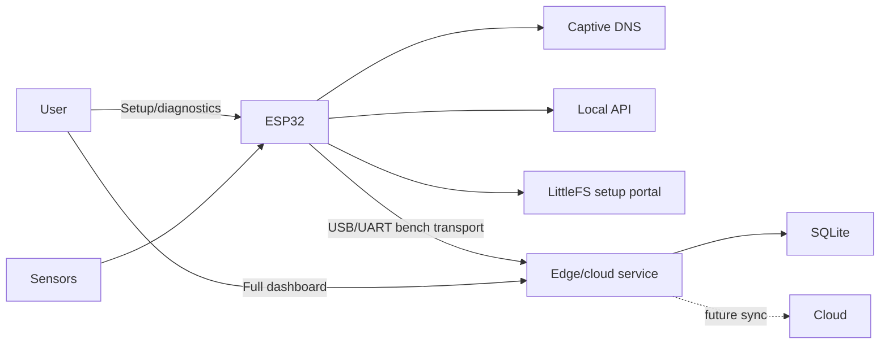

# System Architecture

<!-- FALCON-DOST-REVISION-NOTE:START -->
> **Current revision note (2026-10-10):** Use the DOST major revision baseline in [`docs/REVISION_2026-10-10.md`](REVISION_2026-10-10.md) unless this file is explicitly archived. The active proposal core is a compact ESP32-based buoy with **water pressure sensing, wind speed/direction sensing, GPS for exact position and security, battery + solar power, and Wi-Fi/LTE internet communication**. LoRa, large Bay Station hardware, tall tower layouts, and continuous every-second uploads are legacy or optional fallback assumptions.
<!-- FALCON-DOST-REVISION-NOTE:END -->

## Purpose
Define implemented boundaries and future integration points.

## Scope
ESP32 firmware, local dashboard, planned sensors, edge AI, and remote systems.

## Current Status
The ESP32 acquisition/diagnostic foundation and laptop-hosted edge/cloud prototype are implemented. Event-driven Wi-Fi/LTE transport, cloud endpoint, and physical sensor integrations remain pending.

## Architecture

## Implementation
`main.cpp` owns Arduino lifecycle. `PortalServer` owns LittleFS, AP, DNS, HTTP, API, and volatile monitoring state. `config.h` owns network/asset constants. `data/` owns the minimal ESP32 setup portal. `dashboard-next/` owns the only full dashboard, and its build is served from `edge/static/dashboard/` by the edge service.

Missing assets return 503; AP/DNS initialization failure stops service; dashboard polling failure shows connection loss.

## Future Expansion
Complete physical sensor drivers, event-driven Wi-Fi/LTE cloud transport, authenticated endpoint selection, buffering/retransmission, and field validation while keeping ESP32 diagnostics available independently. Wi-Fi remains the bench path; LTE is the remote field path unless reliable shore Wi-Fi is demonstrated.

The post-approval architecture may add an authenticated on-demand camera,
calibrated environmental sensors, remote communications, and a conditional
Raspberry Pi 5 4GB migration. ESP32 retains time-critical acquisition in every
case. See [`FUTURE_UPGRADES.md`](FUTURE_UPGRADES.md).

## Engineering Notes
No production watchdog policy, OTA, authentication, or fully validated physical sensor layer is implemented.

## Revision History
| Version | Date | Change |
| --- | --- | --- |
| 2.0 | 2026-08-15 | Made Dashboard Next canonical on the edge host and reduced LittleFS to setup/diagnostics. |
| 1.0 | 2026-08-05 | Source-verified architecture. |
