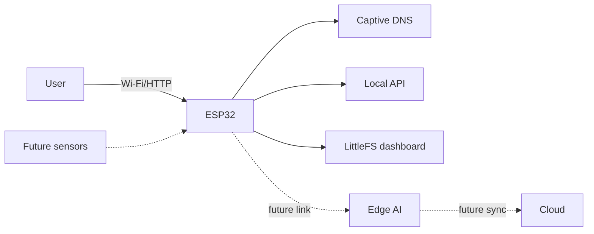

# System Architecture

## Purpose
Define implemented boundaries and future integration points.

## Scope
ESP32 firmware, local dashboard, planned sensors, edge AI, and remote systems.

## Current Status
Only the ESP32 local system is implemented.

## Architecture

## Implementation
`main.cpp` owns Arduino lifecycle. `PortalServer` owns LittleFS, AP, DNS, HTTP, API, and volatile monitoring state. `config.h` owns network/asset constants. `data/` owns HTML, CSS, JavaScript, and logo.

Missing assets return 503; AP/DNS initialization failure stops service; dashboard polling failure shows connection loss.

## Future Expansion
Add independent sensor, storage, edge-link, and security modules while keeping the local ESP32 functional alone.

## Engineering Notes
No scheduler, watchdog policy, persistent storage, OTA, authentication, or sensor layer is implemented.

## Revision History
| Version | Date | Change |
| --- | --- | --- |
| 1.0 | 2026-08-05 | Source-verified architecture. |
