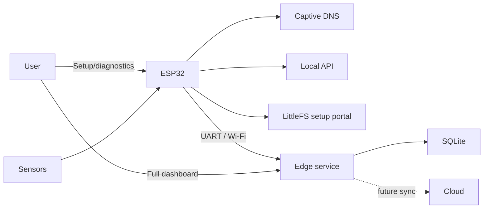

# System Architecture

## Purpose
Define implemented boundaries and future integration points.

## Scope
ESP32 firmware, local dashboard, planned sensors, edge AI, and remote systems.

## Current Status
The ESP32 acquisition/diagnostic foundation and laptop-hosted Bay Station prototype are implemented. LoRa buoy transport, the Bay Station SIM/4G/5G Internet backhaul, final shore mini PC, and physical sensor integrations remain pending.

## Architecture

## Implementation
`main.cpp` owns Arduino lifecycle. `PortalServer` owns LittleFS, AP, DNS, HTTP, API, and volatile monitoring state. `config.h` owns network/asset constants. `data/` owns the minimal ESP32 setup portal. `dashboard-next/` owns the only full dashboard, and its build is served from `edge/static/dashboard/` by the edge service.

Missing assets return 503; AP/DNS initialization failure stops service; dashboard polling failure shows connection loss.

## Future Expansion
Complete physical sensor drivers, LoRa radio/gateway and Bay Station SIM/4G/5G backhaul selection, authenticated cloud/remote deployment, buffering/retransmission, and field validation while keeping ESP32 diagnostics available independently.

The post-approval architecture may add an authenticated on-demand camera,
calibrated environmental sensors, remote communications, and a conditional
Raspberry Pi 5 4GB migration. ESP32 retains time-critical acquisition in every
case. See [`FUTURE_UPGRADES.md`](FUTURE_UPGRADES.md).

## Engineering Notes
No production watchdog policy, OTA, authentication, or fully validated physical sensor layer is implemented.

## Revision History
| Version | Date | Change |
| --- | --- | --- |
| 2.0 | 2026-08-15 | Made Dashboard Next canonical on the edge host and reduced LittleFS to setup/diagnostics. |
| 1.0 | 2026-08-05 | Source-verified architecture. |
